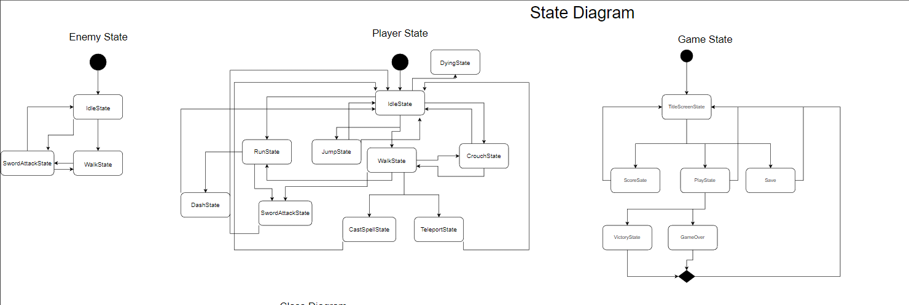
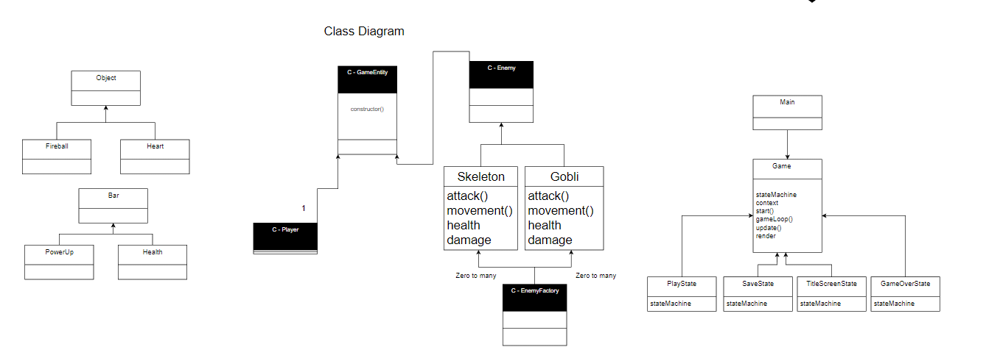
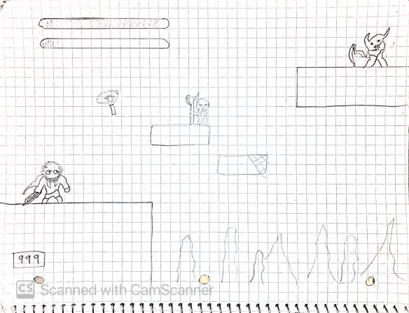
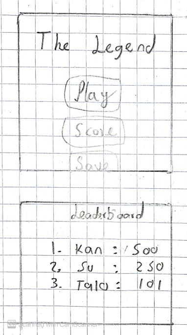
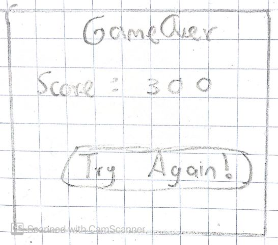

# Game Programming F22 Project - The Legend

     Julian Hernandez Delgado

## ✒️ Description

This is a 2D adventure/action platformer game with a main character. The player will have to advance through the world by walking, running, jumping, crouching and defeating enemies. And, after a long journey they will finally be able to confront the final boss.

## Gameplay

As for movement, the character can move left, right, up and down. Therefore, he will be able to walk, run, dash, climb, and jump. When the player jumps to a vertical obstacle they will be hooked, which will allow to jump to other higher walls and climb up. As for battle, he will use a sword with 3 different attacks to damage enemies. The player will have a health bar, which will decrease when he gets hurt by the enemies. But, the enemies will have a chance of dropping some health for him to heal. But if the player's health bar is empty the player will die. Besides as the player kills enemies, it will increase a power bar that will allow the player to teleport in the direction they are face or cast a spell that will damage the enemies. The player's movement will be controlled by the arrows, the jump by the spacebar, the crouch with the down arrow. The sword attacks by (z,x,c), for powers (a,s).

## Requirements

### What Player can do with character

1. The character shall move left (left arrow)
2. The character shall move right (right arrow)
3. The character shall crouch (down arrow) and walk
4. The character shall be able to jump (space bar)
5. The character should be able to transition between crouch to jump (space bar) or straight (up arrow)
6. The character shall perform attack 1 with keystroke z
7. The character shall perform attack 2 with keystroke x
8. The character shall perform attack 3 with keystroke c
9. The character shall start with a full health bar
10. The character shall start with a empty power bar
11. The character shall be able to heal through the hearts dropped by enemies
12. The character shall be able to cast a fireball (f key)
13. The character shall be able to teleport in the direction they are facing (d) when power bar is full
14. The character shall be able to "hook" to a wall
15. The character shall be able to receive damage
16. The character should be able to dash (v key)
17. The character's power bar should increase when killing enemies
18. The character should be able to walk
19. The character should be able to run
20. The character shall die when health bar is empty
21. The character shall be able to inflict damage to enemies when attacking
22. The character shall get score when killing enemies
23. The character shall win when defeating final boss

## Diagrams

### State Diagram

## Wireframes

## Assets

    Sound: <https://tallbeard.itch.io/music-loop-bundle>

    Font: Zelda.otf - taken from Zelda's assignment by Vik

    Skeleton: https://jesse-m.itch.io/skeleton-pack

    Main character: https://rvros.itch.io/animated-pixel-hero

    Possible map (Oak wood): https://brullov.itch.io/oak-woods

    Possible map 2: https://oisougabo.itch.io/free-platformer-16x16

    Possible map (jungle): https://szadiart.itch.io/platformer-fantasy-set1

    Possible map (mossy cavern): https://maaot.itch.io/mossy-cavern

    Goblin: https://luizmelo.itch.io/monsters-creatures-fantasy
